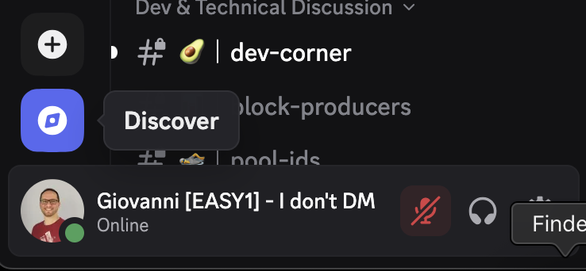
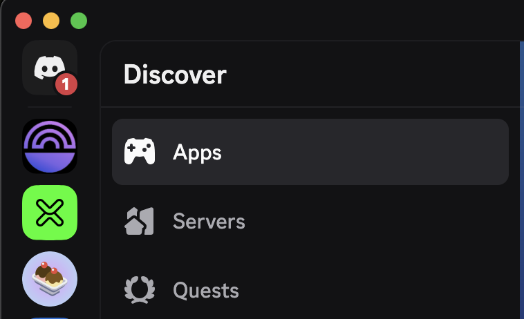
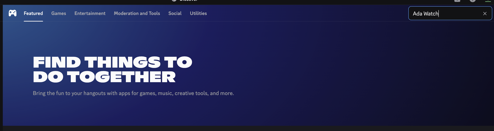
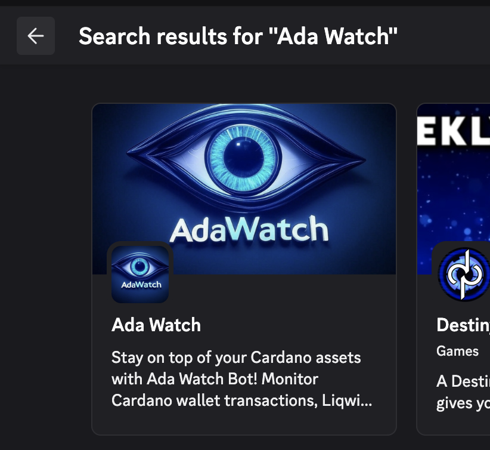
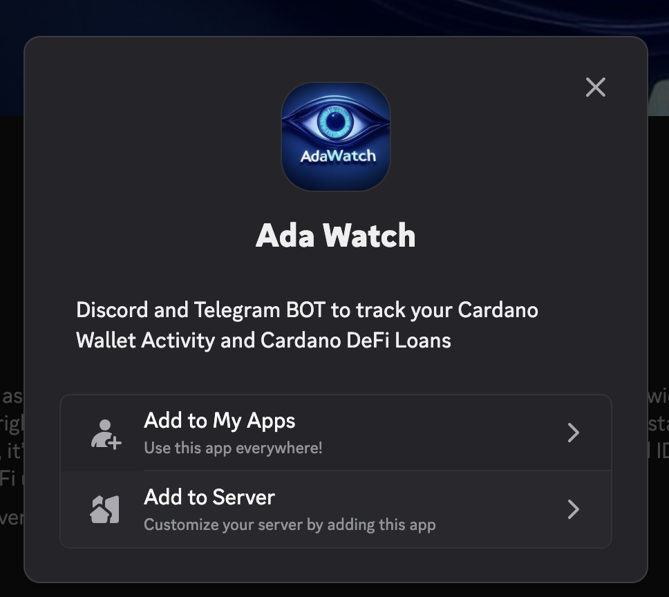

# Ada Watch BOT

Ada Watch Bot is a cross-platform bot available on both Telegram and Discord.
It lets you monitor Cardano wallet activity, track DeFi positions across multiple
protocols, and follow NFT marketplace events — all from your favourite chat platform.

Ada Watch Bot is compatible with [Ada Handle](https://handle.me/): anywhere a Cardano
wallet address is accepted, you can use an Ada Handle (`$yourhandle`) instead.

## How to Access Ada Watch Bot

You can use Ada Watch Bot on both Telegram and Discord.

### Telegram

Open [t.me/AdaWatchBot](https://t.me/AdaWatchBot) and start chatting.

### Discord

To start interacting with Ada Watch Bot on Discord, follow these steps:

* Open Discord and click the Discover button in the sidebar.
  

* Go to the Apps section.
  

* Search for "Ada Watch".
  

* Select Ada Watch Bot from the results and follow the prompts to add it to your
  server or use it in direct messages.
  

* Add Ada Watch to your Apps.
  

* Authorize the app.

## How does it work?

Ada Watch lets a user add up to **20 Cardano wallet addresses** to their watchlist.
Whenever an event of interest involves one of those addresses, the bot sends a
notification.

### Transaction-level activity

Every inbound and outbound transaction on a watched address triggers a notification.
The bot recognises and labels several specialised transaction types:

* **Generic transactions** — fallback for any movement of ADA or tokens.
* **AdaMatic transactions** — see [adamatic.xyz](https://adamatic.xyz/).
* **FluidTokens Aquarium transactions** — see [aquarium.fluidtokens.com](https://aquarium.fluidtokens.com/).
* **SHEN (DJED) rewards distributions** — rewards drops from the SHEN distribution address.
* **JPG Store NFT activity** — new listings, listing updates, sales, withdrawals, and offers
  on [jpg.store](https://www.jpg.store/) that involve any of your watched addresses.

### DeFi positions

If a watched wallet holds positions on a supported lending or CDP protocol, the bot also
surfaces them via the `/check` command and reacts to on-chain state changes.

* **Liqwid Finance** — outstanding loans, with Health Factor (HF) tracked over time.
* **Indigo Protocol** — Collateralized Debt Positions (CDPs), with Collateral Ratio tracked
  against the per-asset Liquidation Ratio (LR) and Redemption Margin Ratio (RMR).
* **FluidTokens Lending** — both **lender** and **borrower** positions on
  [FluidTokens](https://app.fluidtokens.com/), with Collateral Ratio tracked against
  three thresholds (liquidation 125%, warning 135%, healthy 150%). Messages are
  framed differently depending on whether you're the lender (counterparty risk) or
  the borrower (liquidation risk to your collateral).

### Notifications

Ada Watch Bot monitors the on-chain activity of each supported protocol — token price
updates, interest accruals, oracle refreshes — and recomputes the health of every
watched position in near-real-time.

When a health metric crosses a meaningful threshold in either direction, the bot
automatically pushes a notification with the up-to-date numbers (debt, collateral,
current interest rate, collateral ratio / health factor, etc.). Each protocol carries
its own threshold legend at the bottom of the message so the reader can interpret the
headline number at a glance.

## Commands (Discord & Telegram)

The following commands are available on both platforms:

| Command           | Description                                                                  |
|-------------------|------------------------------------------------------------------------------|
| `/add address`    | Add an address (payment, staking, or `$adahandle`) to your watchlist.        |
| `/remove address` | Remove an address from your watchlist.                                       |
| `/check`          | Check status across every watched address (Liqwid, Indigo, FluidTokens).     |
| `/check address`  | Check the status for a single specific address.                              |
| `/list`           | List every address currently on your watchlist.                              |
| `/help`           | Show the welcome / help message.                                             |

These commands behave identically on Discord and Telegram.

## Telegram-specific extras

* `/commands` — list every command available with a one-line description.
* `/check set HH:mm` / `/check unset HH:mm` / `/check list` / `/check clear` —
  schedule recurring daily status checks at a chosen time, or list / remove the
  schedules you have set.
* `/tz` — view or change the timezone used for scheduled checks.

## Support

Issues, questions, feature requests? Email **info.easy1staking@gmail.com**.
